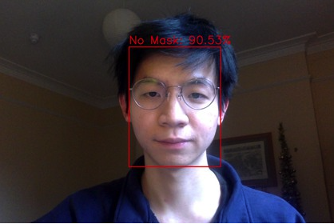
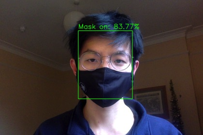

# maskerAId (Hex Cambridge 2021 Submission)

# Hack Cambridge Project: Mask Detection App (MaskerAID)
As a result of the COVID-19 global pandemic, many governments have made mask wearing mandatory to reduce the transmission of the virus. This web app aims to identify people who are not adhering to the law and gently remind them to please, **wear a mask**.

# Frameworks used
- Python
- OpenCV
- Tensorflow

# Applications
This project can be deployed alongside embedded systems in public spaces such as restaurants, banks, airports, etc. to detect if patrons are wearing a mask. Gentle reminders will be issued if the subject is detected to be not wearing a mask.

Deployed App with [streamlit](https://www.streamlit.io/)
