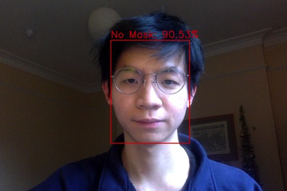

# MaskerAId (Hex Cambridge 2021 Submission)

The world finds itself going through a very difficult, and in many cases, costly pandemic. While we are gradually discerning a light at the end of this long and lonely tunnel, it is more imperative than ever that everyone keeps up all the effort and personal sacrifices made in the name of the the public good. One government measure that has been adopted unilaterally across most nations of the world is the restriction to enter any indoors shop, restaurant or essential retail store without wearing a face covering.

Business owners are required to check that all customers wear a face mask. Large stores are ocassionally finding it difficult to keep track of the customers entering, while all owners and employees are seldomly faced with the perhaps uncomfortable task to ask customers to apply their face covering or being forced to turn them away, in case they don't have one.

MaskerAID provides a smart web app that can be used to check whether entering customers wear a face mask, either by photo or video input. More importantly, it is expected to act as self-regulatory stimulus, whereby customers who may have forgotten to wear their mask will be reminded of doing so by seeing themselves being identified as not wearing a face covering by MaskerAId.

# Frameworks used
- Python
- OpenCV
- Tensorflow

# Applications
This project can be deployed alongside embedded systems in public spaces such as restaurants, banks, airports, etc. to detect if patrons are wearing a mask. Gentle reminders will be issued if the subject is detected to be not wearing a mask.

# User Interface and Examples

Deployed App with [streamlit](https://www.streamlit.io/)
